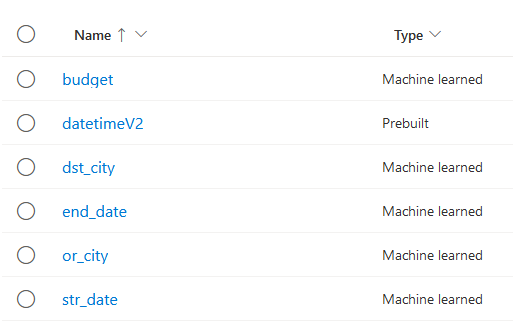
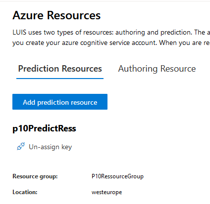
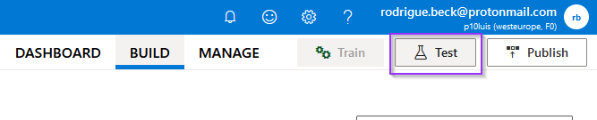
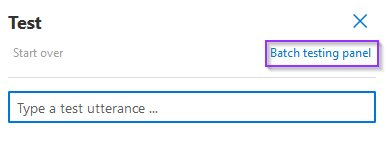
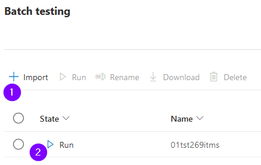
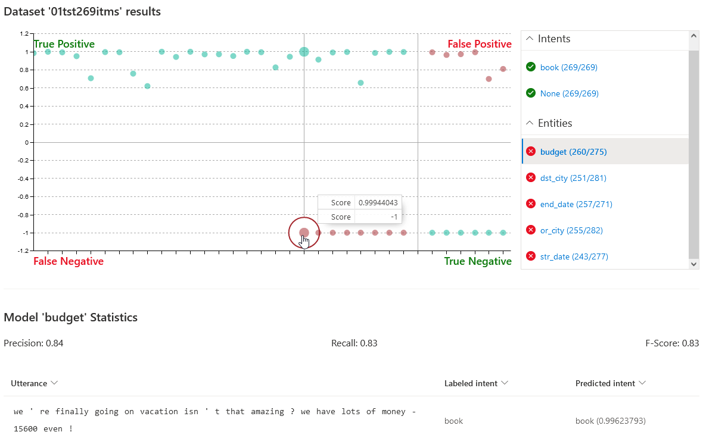
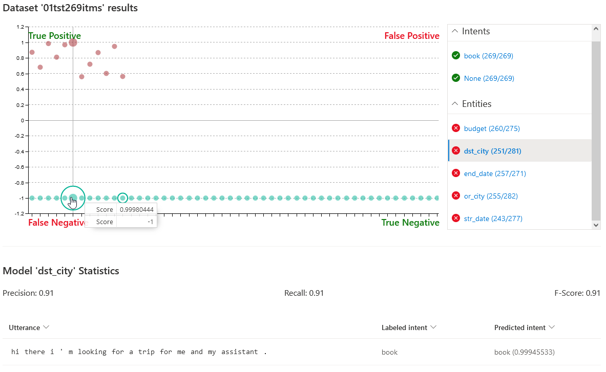
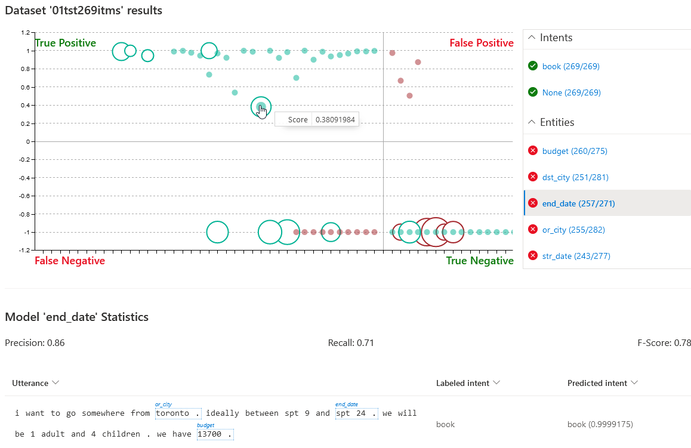
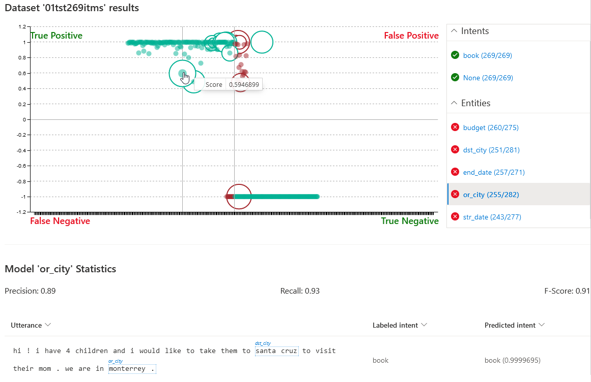
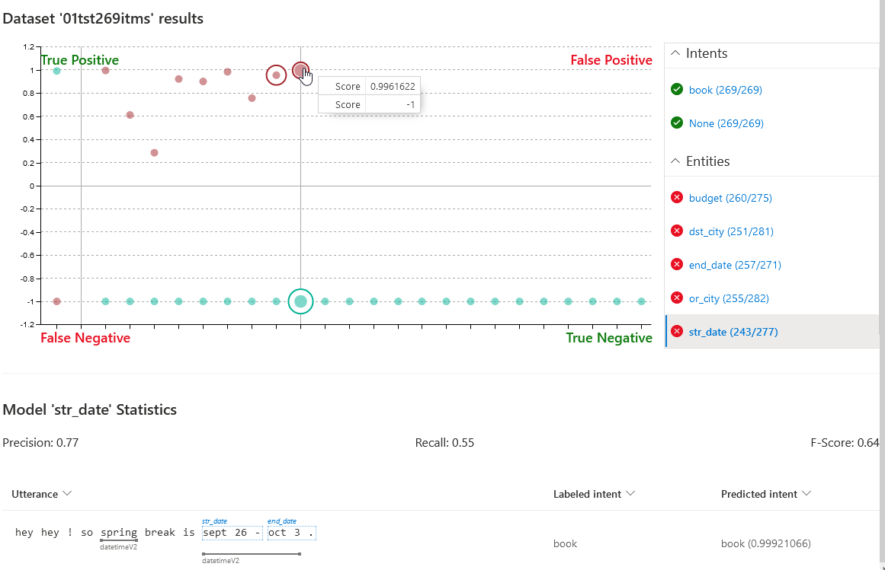

# Le contexte

Nous sommes **Fly Me**, une agence proposant des voyages "clef en main" pour ses clients.
Nous sommes désireux de créer un ChatBot permettant d'apporter un support à nous utilisateurs, afin de choisir une offre optimale, de voyage.
Nous retrouverons ici, les éléments permettant de piloter les performances de ce Bot et du modèle afférent.

# A propos des performances de LUIS

LUIS est une plateforme de Microsoft Azure, permettant de mettre en œuvre ce qui est communément appelé le NLP (Natural Language Processing).
Dans un premier temps il est nécessaire d'entrainer notre modèle en formatant les données d’entrainement de cette manière:

```json
{"text": "I'd like to book a trip to Atlantis from Caprica on Saturday, August 13, 2016 for 8 adults. I have a tight budget of 1700.",
 "intentName": "book",
 "entityLabels": [
        {
            "entityName": "dst_city",
            "startCharIndex": 27,
            "endCharIndex": 35
        },
        {
            "entityName": "or_city", 
            "startCharIndex": 41, 
            "endCharIndex": 48
        },
        {
            "entityName": "str_date", 
            "startCharIndex": 52, 
            "endCharIndex": 77
        },
        {
            "entityName": "budget", 
            "startCharIndex": 117, 
            "endCharIndex": 121
        }
    ]
}
```

Une fois entrainé, il est possible de tester notre modèle, mais avec un formatage des données de test, légèrement différent :

```json
{
    "text": "hey dad, are you hungry?",
    "intent": "None",
    "entities": [
        {
            "entity": "FamilyMember",
            "startPos": 4,
            "endPos": 6
        }
    ]
}
```

Voici les "Entities" qui seront prédites en sortie du modèle:



A noter qu'une entité dite "Prebuilt", **datetimeV2**, a été ajouté afin d'améliorer l'interprétation des dates par le modèle.
Les entités "Prebuilt" sont des entités fournis par Azure, pré entrainés avec leurs propres jeux données.
Nous pouvons en trouver de divers type tel que :
"age, email, money, geographyV2..."

## Mise en garde sur la ressource Azure de test

Il est nécessaire de prendre le soin de créer une ressource spécifique pour les tests.
En effet le "EndPoint" créé avec l'instance du modèle LUIS, permet de tester 1000 portions de texte.
Créer une Ressource spécifique, pour les tests donne accès à 10 000 prédictions supplémentaires!



## Performances après TestSet

La plateforme luis.ai nous offre une fonctionnalité de test, accessible dès l’accueil du modèle créé:



Il est ensuite possible de tester notre modèle, phrase par phrase.
Seulement pour une métrique représentative et cohérente, nous commencerons avec un testSet de 20% du dataSet, soit plus de 260 phrases tests.
Pour nous simplifier ce genre de procédure, la plateforme Luis nous met à disposition le "Batch Testing" :



Il nous restera plus alors, qu'à importer notre TestSet au format présenté en introduction de ce chapitre :



### Entity "budget":



Ici nous obtenons une précision de **84%**.
Il est possible "d'investiguer les 4 cadrans" en cliquant sur un point du graphique et ainsi observer la phrase traitée.
En l’occurrence nous observons , un "**faux négatif**", car le budget est bien énoncé dans la phrase, mais non interprété par le modèle.

### Entity "dst_city":



Pour cette entité nous avons une précision de **91%** .
Nous avons "zoomé" sur une phrase prédite comme un "**Vrai Négatif**". 
Le modèle a correctement prédit le "**for**" dans le sens de "**pour moi**" et non comme "vers telle ville".

### Entity "end_date":



Ici une précision de **86%**.
Le focus est porté sur un "**Vrai Positif**" avec un score de prédiction un faible de 38%.
Des difficultés à interpréter le mot "ideally" ?

### Entity "or_city":



89% de précision, avec une phrase échantillonnée sur le cadran des "Vrais Positif".

### Entity "str_date":



Enfin l'entité de "date aller / **str_date**" avec le plus faible score de précision de **77%**.
Malgré tout, il faut prendre en compte que l'entrainement fut basé sur des chaines de caractère de date et des dates de fin, donc aucune date de départ étiquetée explicitement.
De plus l'entité "datetimeV2" n'est pas évaluée par la plateforme mais aide sensiblement le système à "arbitrer" si une chaine de caractère représente une date de départ ou d'arrivée...

# Mécanisme d’évaluation<br>du modèle en production


Ce schéma nous fait un résumé du mécanisme d'évaluation, d'une part du modèle, mais aussi de la fonctionnalité de remontée d'expérience utilisateur, via **Insight**.

# Pour aller plus loin...

## Modalités de mise à jour

Il est envisageable de travailler d'une façon similaire à la gestion de version de Git, en termes de "branches".
Nous pourrions créer une "nouvelle branche dev" sous la forme d'une seconde application.
Cette seconde application serait présentée, uniquement, à 10-20% d'utilisateur.
Les modifications sur le ChatBot ou la mise à jour des datas pour un nouvel entrainement du modèle, serait apportées seulement à cette 2d version.
Ainsi nous pourrions "merger cette branche avec le master", seulement quand les résultats d'évaluation seraient, significativement, meilleurs?!

### Les options d'améliorations

#### Pour le modèle:

* Nous avons une remontée des "**No**", et nous pouvons en déduire, avec le nombre de dialogues effectués (ou bien remonter également les "Yes"..?), une "**Accuracy**" de notre système.

* Dans ce même ordre d'idée, nous pouvons légitimement nous demander si des utilisateurs iront jusqu'à la confirmation du ChatBot? Ce qui justifierait encore plus de faire remonter l'information du "**Yes**"

* Envisager de détecter les utilisateurs qui finissent par un **No**, mais ne poursuivent pas "l'expérience".

#### Pour le ChatBot:

* Améliorer l'utilisation du **datetimeV2**.
  Car, comme nous avons pu l'observer dans des exemples de dialogues; 
  notre DataSet de départ contient des dates 
  (qui peuvent être ambigus) et des dates de fin. 
  Nous pourrions donc, ajouter des "individus" avec des dates de départ explicites.
* Pour l'instant, les tests automatiques se concentrent sur le modèle, mais nous pourrions y ajouter des tests spécifiques pour le ChatBot. Comme des "tests de non régression"...
* Ne pas laisser une Entity à None avant de demander une confirmation et ainsi éviter de présenter un "texte à tous" qui devrait aboutir à une infirmation!
* Bien entendu, récupérer les dialogues complets et prendre soins de les identifier précisément (clef unique).
